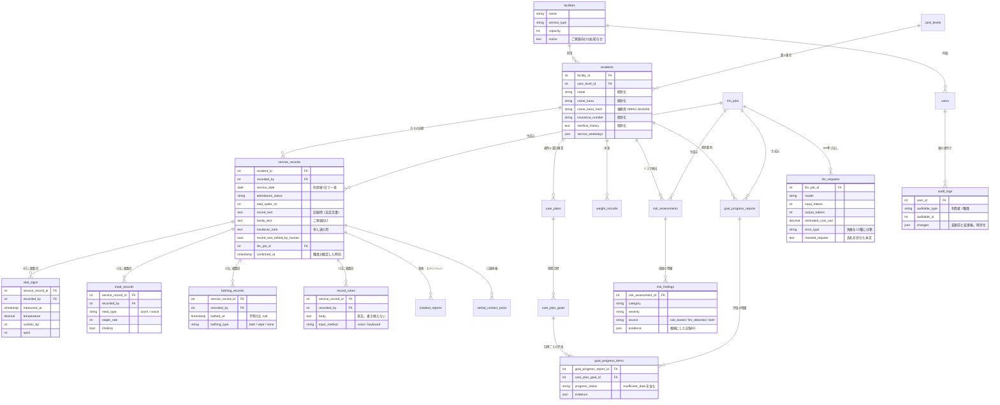

# データベース設計

テーブルは21個あります。マイグレーションを1本ずつ読まなくても構成が分かるよう、全体図と各テーブルの役割をここにまとめます。

スキーマの変遷は `database/migrations/` に残してあります。既存データの移し替えを含むため、途中経過も残す方針です（末尾「マイグレーションの方針」参照）。

---

## 1. 全体図

---

## 2. テーブルの役割

### 基盤

| テーブル      | 役割                                                     |
| ------------- | -------------------------------------------------------- |
| `facilities`  | 事業所。データの分離境界。他事業所の記録は一切見えない   |
| `users`       | 職員。`role` で介護職員・管理者・システム管理者を分ける  |
| `care_levels` | 要介護度のマスタ                                         |
| `residents`   | ご利用者。氏名・保険者番号・住所・既往歴を暗号化して保持 |

### 日々の記録

| テーブル               | 役割                                                                    |
| ---------------------- | ----------------------------------------------------------------------- |
| `service_records`      | サービス提供記録。**ご利用者×利用日で1件**。3種類の文章と確定時刻を持つ |
| `vital_signs`          | バイタル。1日に複数回                                                   |
| `meal_records`         | 食事。昼食・おやつ、入れ直しも別の1件                                   |
| `bathing_records`      | 入浴・清拭。1日に複数回                                                 |
| `record_notes`         | 音声入力・手入力の原文。書き換えず積む                                  |
| `weight_records`       | 体重。記録とは独立（測定日が利用日と限らない）                          |
| `incident_reports`     | 事故・ヒヤリハット                                                      |
| `verbal_contact_tasks` | 送迎時に口頭でお伝えする事項                                            |

### 計画と評価

| テーブル                | 役割                                         |
| ----------------------- | -------------------------------------------- |
| `care_plans`            | 通所介護計画書                               |
| `care_plan_goals`       | 短期目標。計画書に複数ぶら下がる             |
| `goal_progress_reports` | 目標進捗の要約（AI生成）                     |
| `goal_progress_items`   | 目標ごとの評価。`insufficient_data` を持てる |
| `risk_assessments`      | リスク抽出の実行単位（AI生成）               |
| `risk_findings`         | 指摘1件ずつ。検出元と根拠の記録IDを持つ      |

### AI実行と監査

| テーブル       | 役割                                           |
| -------------- | ---------------------------------------------- |
| `llm_jobs`     | AI処理の実行単位。成否と所要時間               |
| `llm_requests` | API呼び出し1回ずつ。トークン数・費用・失敗種別 |
| `audit_logs`   | ご利用者情報と職員アカウントの変更履歴         |

---

## 3. 設計で決めたこと

### 1日に複数回起きることは、別テーブルに持つ

バイタル・食事・入浴・原文は `service_records` のカラムではなく、それぞれ独立したテーブルにしています。

通所介護では送迎・入浴・食事・帰宅で担当が入れ替わり、1人のご利用者の1日を複数の職員が分担して記録します。1カラムに持つと、**あとから入力した職員が前の職員の記録を消す**ことになります。体温は来所時・入浴前・入浴後と測りますし、午前に入浴して午後に清拭する日もあります。

各テーブルは `recorded_by` を行ごとに持ちます。書ける人を狭めるのではなく、書いた人が分かるようにすることで責任の所在を保つ設計です。

### 原文は書き換えない

`record_notes.body` は、AIが何を変えたのかを後から検証するための原本です。訂正は新しい1件として積み、既存の行は更新しません。上書きできる原本は、検証の役に立ちません。

同じ理由で `service_records` は `record_text_edited_by_human` / `family_text_edited_by_human` を持ちます。どこまでがAIの出力で、どこからが人の判断なのかを追えないと、法定文書として説明できません。

### 暗号化した項目は検索できないので、索引を別に持つ

`residents` の氏名・氏名カナ・保険者番号・住所・既往歴はデータベース上で暗号化しています。暗号化した列はSQLの `LIKE` で引けないため、氏名カナの検索だけ `name_kana_hash`（HMAC-SHA256 のブラインドインデックス）を別に持ちます。

一覧の並べ替えも同じ理由でSQLでは行えず、取得後にPHP側で行っています。

### AIの出力には必ず根拠を添えさせる

`risk_findings.evidence` と `goal_progress_items.evidence` は、根拠にした記録のIDを持つJSONです。職員が原典を開いて自分で確かめられない指摘は、画面に出しません。

`risk_findings.source` は `rule_based` / `llm_detected` / `both` を区別します。数値のしきい値判定とAIの読み取りを同じ見た目で並べると、職員がどちらも同じ重さで受け取ってしまうためです。

### 失敗も記録する

`llm_requests` は成功した呼び出しだけでなく、失敗も `error_type` で13種に分類して残します。再試行してよいものと設定の見直しが必要なものを分けるためで、成功だけを見せてもエラーハンドリングを作った意味が伝わりません。

---

## 4. マイグレーションの方針

`database/migrations/` には、設計が変わった経緯をそのまま残しています。完成形を1本で作り直してはいません。

たとえば入浴は「真偽値のカラム」→「3択のカラム」→「独立したテーブル」と変わりました。最後の変更では、既存の値を新しいテーブルへ移し替える処理をマイグレーション内に書いています（`2026_09_15_100002_create_bathing_records_table`）。

- 時刻が分からない既存データは `null` のままにします。それらしい値で埋めると、あとから実測値か埋めた値かが区別できなくなります
- 古いカラムは、読み手（コントローラ・画面・LLM）の移行が済んでから別のマイグレーションで落とします
- 外部キーが参照しているインデックスを差し替えるときは、置き換えを先に作ってから古いものを落とします。MySQL/MariaDB は外部キーの列にインデックスを要求するためで、SQLite では再現しません（テストはSQLiteで走ります）

動いているものを壊さずに変える手順そのものを残す意図です。
